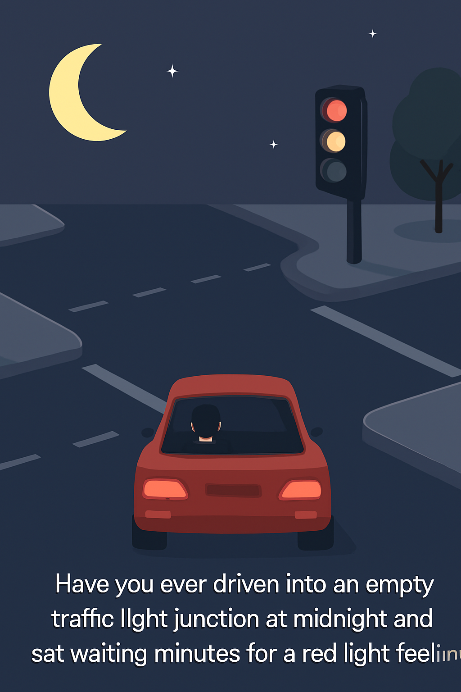
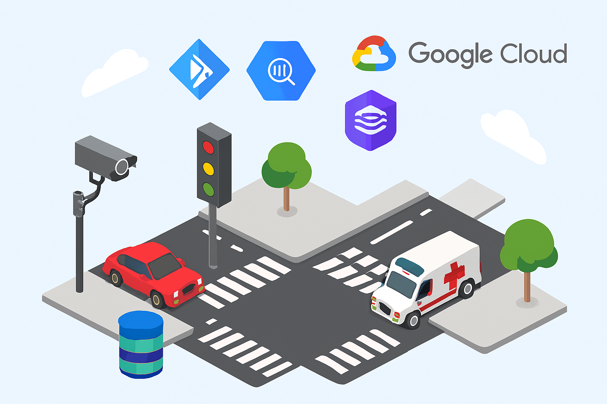

# vintelaific 🌃🚥🚑
vintelaific : AI Traffic Light # Kaggle Google Capstone Project, Computer Vision, CCTV Camera, Agentic AI

## Artificial Intelligence Traffic Light 

### Problem Statement

Have you ever driven through a traffic light junction late at night, with no other vehicles in sight, only to be stuck waiting at a red light for minutes? Feeling dumb but you're a law abiding citizen?

### Why agents?

Agents are the right solution because traffic control is distributed, dynamic, and context‑sensitive. Google Cloud provides the infrastructure to make this agentic approach practical:

Vertex AI Agents: Orchestrate multi‑agent pipelines with LLM‑powered reasoning.
Pub/Sub: Enables agent‑to‑agent (A2A) communication across junctions.
Cloud Functions / Cloud Run: Lightweight deployment of vision, policy, and control agents.
BigQuery + Cloud Storage: Store long‑term traffic episodes and compact context for efficient planning.
Cloud Logging + Cloud Monitoring: Provide observability with tracing, metrics, and alerts.

### What you created

An Artificial Intelligence Traffic Light System that leverage AI, CV, CCTV Camera & other sensors, so that it can be smarter than ordinary traffic light which can save time, reduce congestion, improve safety, and optimize urban mobility.

### Demo

The architecture simulates a multi‑junction traffic light controller using Google Cloud services:

VisionAgents (Cloud Run + OpenCV): Detect cars and emergency vehicles from video feeds.
PolicyAgent (Vertex AI): Plans green/red durations, overrides for emergencies, leverages compacted context from BigQuery.
ControlLoopAgent (Cloud Functions): Applies decisions, supports pause/resume for long‑running operations.
Coordinator (Pub/Sub): Orchestrates parallel → sequential → loop agent pipeline across junctions.
MemoryBank (BigQuery): Stores episodes, compacts older context for efficient policy input.
Evaluation (Cloud Monitoring dashboards): Measures fairness, queue reduction, emergency impact, and latency.

### The Build

Python + OpenCV: Core agent logic and vehicle detection.
Vertex AI: PolicyAgent reasoning, context‑aware planning.
Pub/Sub: Agent‑to‑agent communication and event broadcasting.
Cloud Functions / Cloud Run: Deployment of agents as microservices.
BigQuery: Long‑term memory storage with context compaction.
Cloud Logging + Monitoring: Observability, tracing, and evaluation metrics.

### If I had more time, this is what I'd do

ADK on Vertex AI: Formalize agent lifecycle (observe, plan, act) with schema validation.
Context Engineering: Use BigQuery ML to compact historical episodes and feed summaries into PolicyAgent.
Observability: Export structured logs to Cloud Monitoring, build dashboards for queue reduction and emergency throughput.
Agent Evaluation: Benchmark heuristic vs LLM vs RL policies using replayed BigQuery datasets.
A2A Protocol with Pub/Sub: Implement inter‑junction negotiation and emergency broadcast channels.
Agent Deployment: Containerize agents with Cloud Run, orchestrate with GKE, autoscale based on traffic volume, and expose REST APIs for integration with city systems.

